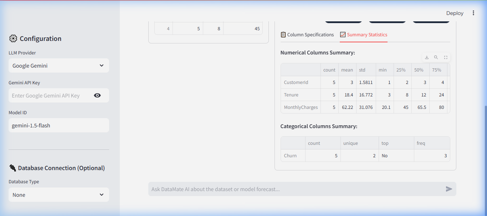
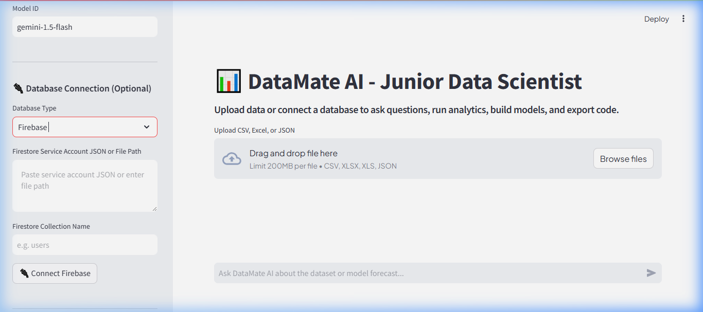

# 📊 DataMate AI: Autonomous AI Data Analysis Agent

An advanced, autonomous **"Junior Data Scientist"** agent designed to perform end-to-end data ingestion, exploratory data analysis, natural language querying, machine learning modeling, and plotting. 

Unlike simple prompts or text-based SQL converters, **DataMate AI** writes, tests, executes, and auto-corrects Python code within a secure sandboxed runtime, providing real-time data science deliverables along with a full Jupyter notebook export of the session.



---

## ✨ Features

- 📤 **Versatile Ingestion**: Support for CSV, Excel (`.xlsx`, `.xls`), and JSON files.
- 🔌 **Live Database Integration**:
  - **Relational Databases**: SQLite, PostgreSQL, and MySQL.
  - **NoSQL / Cloud Databases**: Firebase Firestore collection loader (with JSON schema and service account authentication).
  
  
- 📊 **Automated Exploratory Data Analysis (Auto-EDA)**: Instantly generates row/column metrics, missing cell percentages, duplicated checks, datatype column specifications, and comprehensive pandas-based summary statistics.
- 🔄 **Autonomous Self-Correction Loop**:
  - Catches runtime and syntax exceptions during local code execution.
  - Feeds tracebacks back to the LLM with up to 3 automatic retries to self-correct and deliver working code.
- 🎨 **Matplotlib & Seaborn Interception**: Seamlessly captures plotting figure objects on the server (using a non-blocking thread-safe `Agg` backend) and outputs charts directly inside assistant chat bubbles.
- 📓 **Jupyter Notebook Handoff**: Packages all successful code execution blocks from your session history into a standard, downloadable `.ipynb` notebook file.
- ⚙️ **Multi-Model Provider Support**: Configure OpenAI (`gpt-4o`) or Google Gemini (`gemini-1.5-flash` or custom models) with API keys directly from the sidebar.

---

## 📂 Project Structure

```text
ai_data_analysis_agent/
├── assets/                          # Application UI and demonstration assets
│   ├── datamate_preview.png         # Main application dashboard preview
│   └── firebase_connector.png       # Firebase Firestore connection interface
├── ai_data_analyst.py               # Main Streamlit web application & conversation state logic
├── executor.py                      # Secure sandboxed Python Code Executor & Jupyter export utilities
├── requirements.txt                 # Project dependencies & libraries
└── test_churn.csv                   # Sample customer churn dataset for manual verification
```

---

## ⚙️ Technologies & Libraries Used

DataMate AI relies on the following key tools and libraries to function:

- **Frontend & App Framework**: [Streamlit](https://streamlit.io/) (v1.41.1) for constructing a premium interactive web UI.
- **Agent Backend & Execution**:
  - Custom isolated Python sandbox for code execution (`exec()` with custom locals/globals).
  - Multi-LLM provider orchestration: Supports **Google Gemini** (via `google-genai` and `google-generativeai`) and **OpenAI** (via `openai`).
- **Data Engineering & Science**:
  - [Pandas](https://pandas.pydata.org/) & [NumPy](https://numpy.org/) for data cleaning, transformation, and structural calculations.
  - [Scikit-Learn](https://scikit-learn.org/) for building predictive regression, classification, and clustering models.
- **Visualizations**:
  - [Matplotlib](https://matplotlib.org/) and [Seaborn](https://seaborn.pydata.org/) for static charts (automatically caught by the executor).
  - [Plotly](https://plotly.com/) for interactive web graphics.
- **Database Adapters**:
  - `sqlite3` (built-in) for SQLite databases.
  - `psycopg2-binary` for PostgreSQL.
  - `pymysql` for MySQL.
  - `firebase-admin` for Google Firebase Firestore.
- **Code Export**:
  - [nbformat](https://nbformat.readthedocs.io/) for dynamic generation of standard Jupyter Notebook (`.ipynb`) files.

---

## 🛠️ Installation & Setup

### 1. Clone the Repository
```bash
git clone https://github.com/Shubhamsaboo/awesome-llm-apps.git
cd awesome-llm-apps/starter_ai_agents/ai_data_analysis_agent
```

### 2. Set Up a Virtual Environment (Optional but Recommended)
```bash
python -m venv venv
# On Windows
venv\Scripts\activate
# On macOS/Linux
source venv/bin/activate
```

### 3. Install Dependencies
```bash
pip install -r requirements.txt
```

---

## 🚀 How to Run the App

Launch the Streamlit web application:
```bash
streamlit run ai_data_analyst.py
```
Open [http://localhost:8501](http://localhost:8501) in your browser.

---

## 📖 Usage Guide

1. **Configure LLM & API Keys**:
   - In the sidebar, select **Google Gemini** or **OpenAI**.
   - Input your corresponding API key.
2. **Incorporate Data**:
   - **Upload a file** (e.g. CSV/Excel) to start analyzing instantly.
   - **Optional Database Connection**: Select your database engine (SQLite, PostgreSQL, MySQL, or Firebase), fill in the connection details, and click **Connect**.
3. **Explore Data**:
   - Click the **👀 Data Table Preview** or **📊 Auto-EDA Report** dropdowns to view data health summaries.
4. **Chat & Query**:
   - Type queries in natural language (e.g. *"Plot a correlation heatmap"*, *"Train a random forest to predict column X"*, or *"Find the top 5 records by tenure"*).
   - Expand the **Console Prints** or **Code Executed** status details to see the code wrote and ran.
5. **Download Code**:
   - Click **📥 Export Notebook (.ipynb)** in the sidebar to download the complete analysis sequence as a Jupyter notebook.
